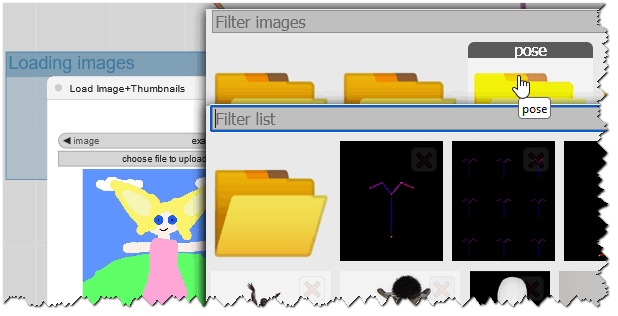

# [📷] Load Image Thumbnails for ComfyUI
Load Image thumbnails, delete images, browse input subfolders. Subfolders now load images!

<p align="center">
 
 
</p>

## Options


| Attribute | Default |
| --- | --- |
| `Show File Names` | False |
| `Show Thumbnails` | True |
| `Thumbnails Size` | 100 |

Thumbnails are lazy loaded, and sized by their max-height. It looks better that way, almost like a masonery. Example without filenames:


## Installation
### Manual Download
1. Open a terminal inside the 'custom_nodes' folder located in your ComfyUI installation dir
2. Use the `git clone` command to clone the [ComfyUI-Thumbnails](https://github.com/audioscavenger/ComfyUI-Thumbnails) repo under ComfyUI\custom_nodes\
```
git clone https://github.com/audioscavenger/ComfyUI-Thumbnails
```

## Known Issues
- Images loaded from subfolders will not close the parent folder yet. Just click anywhere to close the dialog.
- does not handle more than 1 level of subfolders

## RoadMap

### Goal: 1.30
- [ ] fix parent root folder not closing or live with it
- [x] browse subfolders of input - yay we did it!
  - [x] fix subfolder image calls: view&subfolder=folder stopped working
  - [x] pass subfolders as objects in py
  - [x] show subfolders as folder icon
  - [x] disable deleteBtn on folders
  - [x] remove litegraph event listener
  - [x] build actual list for files and subfolders in py
  - [x] replace [object Object] by folder name
  - [x] pass folders and their content to addImg
  - [x] create thisSubRoot content with subfolder files - kind of
  - [x] add .. folder to thisSubRoot
  - [x] store thisRoot in local storage - just files dictionary
  - [x] replace thisRoot content with new subfolder content with new click listener
  - [ ] have a good night sleep

### WIP 1.30
- now we load subfolders, correct image paths, images load, but we can't close the root LoadImage widget

### WIP 1.27
- now we load subfolders, correct image paths, images load, but we can't close the root LoadImage widget

### WIP 1.26
- added version prompt at loading time
- added import hashlib
- fixed LoadImage override properly in __init__ and main class

### WIP 1.25
- moved foldersDict in storage, and fixed folder icons

### WIP 1.24
- fixed ComfyUI-Thumbnails/issues/2: no dependency on node_helpers.py anymore

### WIP 1.23
- try and fix after November 2024 upgrade to TS engine. Thumbnails are back baby!
- BUG: second time you click on load image, foldersDict is empty -> all folders are therefore removed due to invalid extension

### release 1.22
- definitely chose api name as `/customnode/deleteImage`

### release 1.21
- bugfix for nodes taht load inexistant images like SDXL Empty Latent etc

### release 1.20
- added slide-in size
- pre-load images
- delete images
- show image name on hover

### release 1.10
- published in comfy-registry

### release 1.0.1
- added option to hide filenames

### release 1.00
- It just works... stole some code from KJNodes again


## :ribbon: Licence
[AGPL 3.0](https://choosealicense.com/licenses/gpl-3.0/)


## :beer: Buy me a beer
Like my work? This tool helped you? Want to sponsor more awesomeness like this?

<p align="center">
 <a href="https://www.paypal.com/donate/?hosted_button_id=CD7P7PK3WP8WU"></a>
</p>
